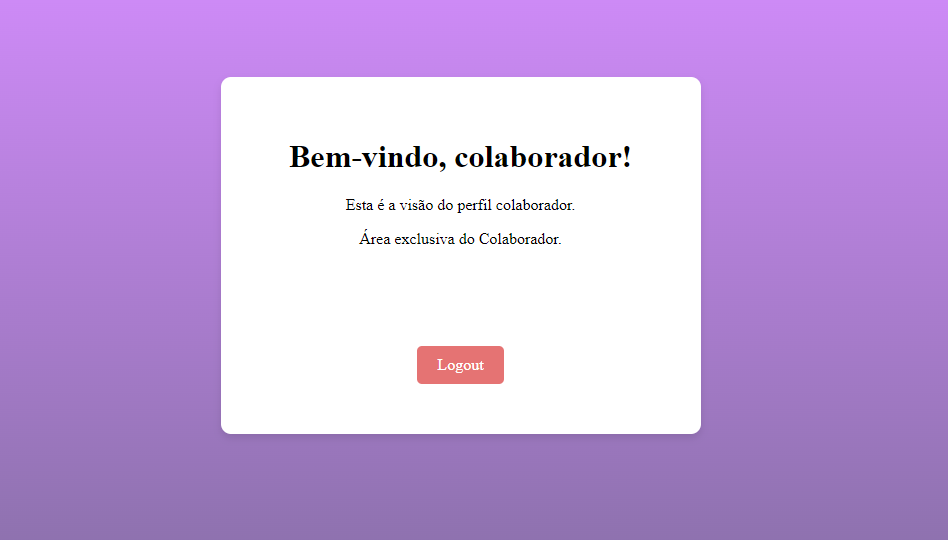
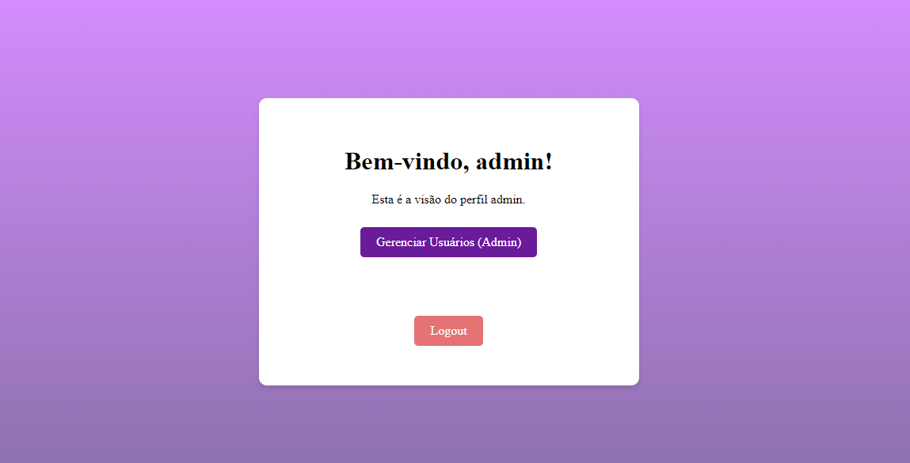
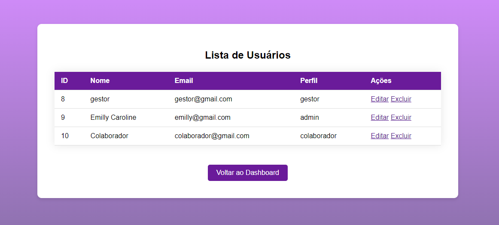

# cadlog-system
[Descrição](https://github.com/emillycaaroline/cadlog-system#-descri%C3%A7%C3%A3o)

[Funcionalidades](https://github.com/emillycaaroline/cadlog-system#%EF%B8%8F-funcionalidades)
- [Admin](https://github.com/emillycaaroline/cadlog-system#admin)
- [Gestor](https://github.com/emillycaaroline/cadlog-system#gestor)
- [Colaborador](https://github.com/emillycaaroline/cadlog-system#colaborador)
- [Banco de dados](https://github.com/emillycaaroline/cadlog-system#-banco-de-dados)

[Tecnologias utilizadas](https://github.com/emillycaaroline/cadlog-system#%EF%B8%8F-tecnologias-utilizadas)

[Visual do Site](https://github.com/emillycaaroline/cadlog-system#-visual-do-site)

[Desenvolvimento em CSS](https://github.com/emillycaaroline/cadlog-system?tab=readme-ov-file#oque-foi-desenvolvido-em-css)

## 📋 Descrição 

Este projeto foi desenvolvido em sala na disciplina de `Programação Web II` no `Colégio Marista Irmão Acácio`. Os arquivos desenvolvidos em PHP apresentam uma tela de cadastro e de login, onde na de login é possivel escolher tres tipos de usuários Admin, Gestor e colaborador onde vão ser levados para uma pagina parecida mas com ações a mais ou a menos.

### 🖇️ Funcionalidades:
Possuem  três tipos de usuários admin, gestor e Colaborador, onde no Cadastro a pessoa terá como selecionar seu tipo de usuário e terá a liberdade de usabilidade do usuário escolhido.

### Admin: 
Ao entrar na conta de admin o usuário podera vetodos os usuários cadastrados no banco de dados, tambem podera editar e excluir.

### Gestor:
O usuário gestor pode apenas vizualizar e editar os usuários cadastrados no banco de dados.

### Colaborador:
O colaborador apenas irá apenas se cadastrar, não consegue ver os usuários, excluir e nem editar.

### 📊 Banco de Dados
O código para o banco de dados esta na pasta [database.sql](https://github.com/emillycaaroline/cadlog-system/blob/main/database.sql) (Funciona apenas no servidor local).

## 🛠️ Tecnologias Utilizadas

- GitHub
- HTML5
- PHP
- CSS
- PHPMyAdmin

## 👀 Visual do Site
**Tela de Login**  
Utilizada para usuários que ja possui cadastro, onde só com email e login ja entra:  
 
 
**Tela de Cadastro**  
Ultilizada por usuários que estao entrando pela primeira vez:    
 

**Tela de inicio Colaborador**  
A tela de colaborador não tem nenhuma ação diferente funcional:    
 

**Tela Inicial Admin/Gestor**  
Essa é a tela inicial do Admin e será parecida para gestor:  
 

**Lista de Usuário**  
Essa lista de usuário apareça apenas para admin e gestor.  
 

## Oque foi desenvolvido em CSS

- Em `body` foi adicionado um fundo em degradê roxo e todos os itens foram centralizados.
- Campos de texto foram almentados, foi adicionado bordas arredondadas e uma borda e sombra roxa quando clica nele.
- O botão foi almentado, arredondado e adicionado uma sombra que aparece quando passa o cursor do mause.
- Todas os titulos foram escolhidos tamanho e fonte.
- A mensagem de erro de senha ou email errado, aparece na própia tela de login.

## Meu git:  
[ Emilly Caroline ](https://github.com/emillycaaroline)   

