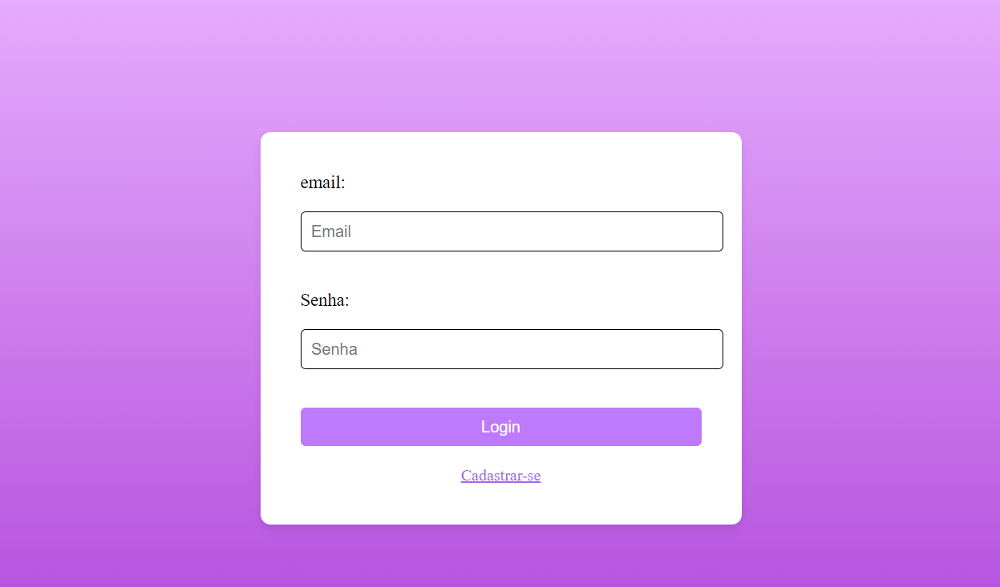
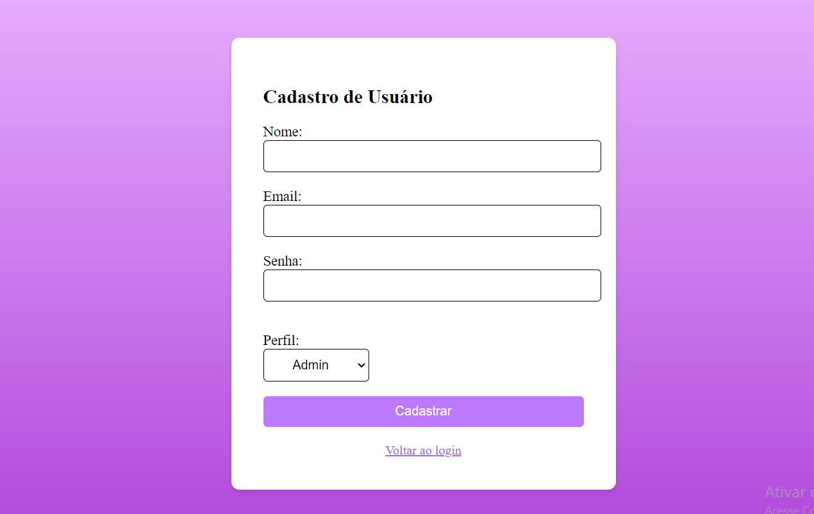

# cadlog-system

README

# 🔍 CadastroE

## 📋 Descrição 

Este projeto foi desenvolvido em sala na disciplina de `Programação Web II` no `Colégio Marista Irmão Acácio`. Os arquivos desenvolvidos em PHP apresentam uma tela de cadastro e de login, onde na de login é possivel escolher tres tipos de usuários Admin, Gestor e colaborador onde vão ser levados para uma pagina parecida mas com ações a mais ou a menos.

### 🖇️ Funcionalidades:
Possuem  três tipos de usuários admin, gestor e Colaborador, onde no Cadastro a pessoa terá como selecionar seu tipo de usuário e terá a liberdade de usabilidade do usuário escolhido.

### Admin: 
Em desenvolvimento...

### Gestor:
Em desenvolvimento...

### Colaborador:
Em desenvolvimento...

### 📊 Banco de Dados
Em desenvolvimento...

## 🛠️ Tecnologias Utilizadas

- GitHub
- HTML5
- PHP
- CSS
- PHPMyAdmin

## 👀 Visual do Site
**Tela de Login**  
Utilizada para usuários que ja possui cadastro, onde só com email e login ja entra  
 
 
**Tela de Cadastro**  
Ultilizada por usuários que estao entrando pela primeira vez    

## Oque foi desenvolvido em CSS

- Em `body` foi adicionado um fundo em degradê roxo e todos os itens foram centralizados.
- Campos de texto foram almentados, foi adicionado bordas arredondadas e uma borda e sombra roxa quando clica nele.
- O botão foi almentado, arredondado e adicionado uma sombra que aparece quando passa o cursor do mause.
- odas os titulos foram escolhidos tamanho e fonte.
- Todo o código esta devidamente documentado

## Métodos ultilizados no site.
Em desenvolvimento...

## Meu git:  
[ Emilly Caroline ](https://github.com/emillycaaroline)   

